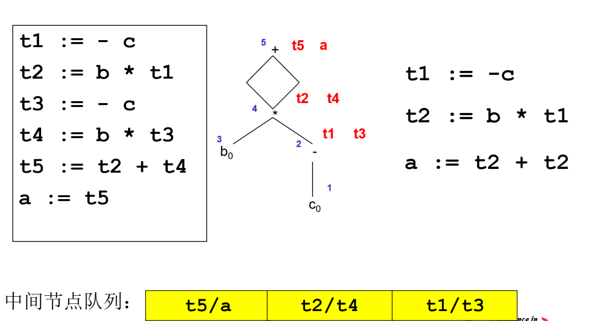
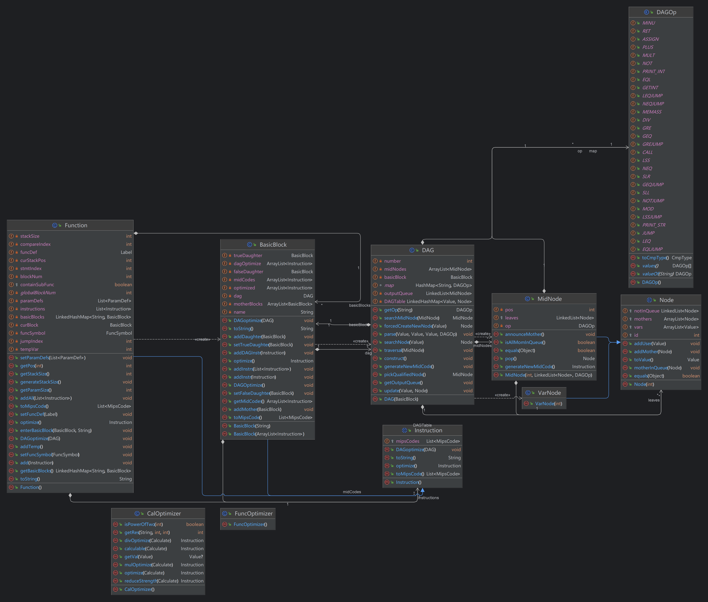

# Optimization Article
## Optimization Steps
### BasicBlock Establishment
A new attribute List<<BasicBlock>> is added in Function to establish a basic block flowchart. All my optimizations are based on basic blocks, and due to lack of time, I did not complete the global optimizations, which is quite regrettable.

### Actual Optimization
#### Constant Calculation
In the intermediate code generation, there is a getCalculable() method that calculates all constants. Taking AddExp as an example:
```java
public int getCalculable() {
    if (op == null) {
        return mulExp.getCalculable();
    } else {
        int mul = mulExp.getCalculable();
        int add = addExp.getCalculable();
        return switch (op.context) {
            case "+" -> mul + add;
            case "-" -> mul - add;
            default -> throw new IllegalStateException("Unexpected value: " + op.context);
        };
    }
}
```
Recursively call the syntax subtree to obtain constant calculations.

#### Constant Propagation
This part involves the CalOptimizer class. If all are constants, then optimize a Calculate intermediate code into an assignment code. Otherwise, return the original Calculate intermediate code.

#### Dead Function Removal
This part is designed for function optimization, traversing all functions, if it is found that it has never been called, then the function is deleted within IRModule.

#### Common Subexpression Deletion


For each basic block, a node table is established. Then generate nodes in reverse order, and finally generate a new intermediate code.
This part involves DAGOptimizer, which is divided into three parts: constructing a DAG graph, outputting in reverse order, and generating new intermediate code.

#### Intermediate Variable Deletion
Since I implemented SSA, there are many intermediate variables that are discarded after a few uses, so I implemented
tmp = a + b;
c = tmp;
Replaced with c = a + b;
tmp = a;
b = tmp + tmp;
Replaced with b = a + a;
Two replacements.

#### Unreachable Conditional Expression Block Deletion
During the conversion of Cond expressions to intermediate code, a Cmp value is obtained similar to constant calculation. If the result is still CmpExp, then normal generation of jumps and other code blocks is performed. However, if a BoolValue is generated, it means it's always true or always false, and at this time, the else or if stmt blocks in the function's basic block chain can be deleted. This reduces the generation of assembly code.
The same principle applies to For expressions.
