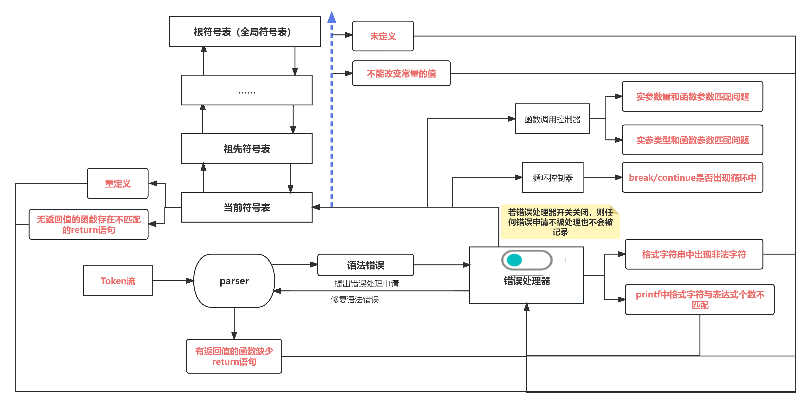
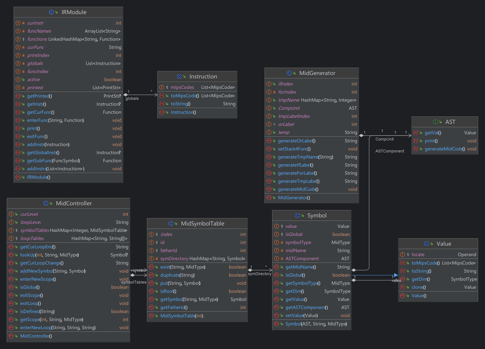
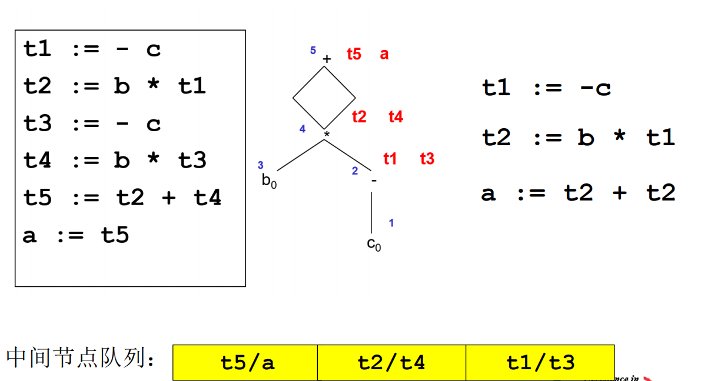

*README*

# C-to-Mips Compiler

This individual project(2023 Fall) is a compiler that translates modified C language code into executable MIPS assembly language. The compiler is implemented entirely in Java and does not require additional dependencies or tools to run.

## Branches

The project is organized into the following branches, each representing a new feature or module added to the compiler:

- **`1_Lexer`**: The lexer module for lexical analysis, responsible for tokenizing the input C code.
- **`2_Parser`**: The parser module, which parses the tokenized input and builds an Abstract Syntax Tree (AST).
- **`3_MidCode`**: The intermediate code generation module, responsible for converting the AST into an intermediate representation using a custom-created four-address code (quadruples).
- **`4_ErrHandler`**: The error handling module, which manages syntax and semantic errors during compilation.
- **`5_Target`**: The target code generation module, which translates the intermediate representation into MIPS assembly code.
- **`6_Optimizer`**: The optimization module, which applies optimizations to the MIPS code to improve performance.

## Features

- **Lexical Analysis**: The lexer identifies keywords, operators, identifiers, and other language constructs in the C code.
- **Syntax Parsing**: The parser checks the syntax of the C code and generates an Abstract Syntax Tree (AST).
- **Intermediate Code**: Converts the AST into a custom four-address code (quadruples) for further processing.
- **Error Handling**: Provides detailed error messages to help identify and fix issues in the C code.
- **MIPS Code Generation**: Generates MIPS assembly code that can be executed on a MIPS processor.
- **Code Optimization**: Optimizes the generated MIPS code to enhance execution efficiency.

# Compilation Design
## Reference Compiler Introduction
It seems there are no references...

## Overall Compiler Design
### Design Architecture


### File Organization


### Interface Design (Introduced below)

## Lexical Analysis Design:
### Architecture Analysis


#### Design Approach

Lexical analysis mainly uses a "state machine" approach, reading the "next" character according to the grammar specification, and identifying reserved words, identifiers, numbers, strings, etc. It converts the text stream into a sequence of $Tokens$.

#### Code Implementation


##### Class Introduction
Lexical analysis includes the analyzer class (Lexer.java), Token class (Token.java), TokenType class (LexType.java), and character judgment/conversion class (MyCharacter.java).

+ **Token**
  The Token class is more like a Record, all of its attributes are final, because once created, there will be no moments of modification.

  | Attribute Name | Type | Role |
  | :------------: | :--: | :--: |
  | context       | String | The content of this token |
  | type          | LexType | The type of this token |
  | lineNum       | Integer | Reserved interface for error handling, ready to output errors |
  | number        | Integer | If it is of type `INTCON`, convert the number, otherwise set to null |

  | Method Name | Return Type | Role | Caller |
  | :--------: | :--------: | :--: | :----: |
  | Token      | Token      | Constructor | Lexer |
  | print      | void       | Output token content to file | Output |

+ **LexType**
  LexType is an enumeration class that records all possible types of Tokens, such as plus signs, minus signs, reserved words, keywords, etc.

  

+ **MyCharacter**
  MyCharacter is a utility class similar to the Java built-in class `Character`. It provides methods for character judgment and conversion, suitable for our lexical analysis.

  | Method Name | Return Type | Role |
  | :---------: | :---------: | :--: |
  | isDigit     | Boolean    | Determine if the current character is a digit |
  | isLetterOrUnderscore | Boolean | Determine if the character is a valid identifier start |
  | isValidIdentifier   | Boolean | Determine if the character is a valid identifier |
  | isEscape    | Boolean    | Determine if the character is an escape character |
  | isBlank     | Boolean    | Determine if the character is a space |
  | is*****     | Boolean    | Specific character judgment |

+ **Lexer**
  Lexer is the focus of lexical analysis, a singleton class, mainly including reading the next character and pre-reading the next character, merging to generate various Tokens.

  | Attribute Name | Type | Role |
  | :------------: | :--: | :--: |
  | lexer         | Lexer | Singleton |
  | src           | String | Source code in text form |
  | reserves      | HashMap<String, LexType> | Reserved words |
  | curPos        | int | Current character position |
  | linePos       | int | Current line number, used for generating Tokens and error reporting |
  | tokens        | ArrayList<Token> | Token sequence generated |
  | errFlag       | bool | Whether error handling is enabled |
  | errs          | ArrayList<Integer> | Lexical analysis error line numbers |
  | now           | Token | Used and updated in the syntax analyzer, the current Token |

  | Method Name | Parameters | Return Type | Role | Caller |
  | :--------: | :--------: | :---------: | :--: | :----: |
  | Lexer      |            | Lexer       | Constructor, generates a sequence of reserved word recognition corresponding to LexType | |
  | getInstance |            | Lexer       | Returns an instance | Main |
  | analysis   |            | void        | Lexical analysis, reads the corresponding character and jumps to the corresponding Token generation method | Lexer |
  | isEndOfSrc  |            | boolean     | Determines whether lexical parsing is complete |
  | getChar     |            | char        | Gets and updates the current character | Lexer |
  | unGetChar   |            | char        | Gets and backs up the character | Lexer |
  | identifier  | StringBuilder: character sequence | Token | Parses out the identifier Token | Lexer |
  | number      | StringBuilder: character sequence | Token | Parses out the number Token | Lexer |
  | string      | StringBuilder: character sequence | Token | Parses out the string constant | Lexer |
  | escape      | char c     | void        | Updates attributes for corresponding escape characters | Lexer |
  | operator    | StringBuilder: character sequence | Token | Parses out calculation and conditional operators | Lexer |
  | singleLineNode | StringBuilder: character sequence | Token | Parses out single-line comments | Lexer |
  | crossLineNote | StringBuilder: character sequence | Token | Parses out multi-line comments | Lexer |
  | print       |            | void        | Prints | Lexer |
  | **next**    |            | Token       | Gets and updates the current Token | Parser |
  | **preRead** |            | Token       | Pre-reads without updating Token | Parser |
  | backTrace   |            | Token       | Error rollback | Parser |
  | fix         | String: completion content | void | Error completion and updates the current token |
  | judge       |            | int         | Determines which grammar the current Stmt corresponds to | Parser |

### Post-coding Modifications/Refactoring
+ Syntax Analysis:
  + Because the syntax analysis $Stmt$ cannot be distinguished by pre-reading, etc., a special judgment judge is added, which is specifically implemented in the syntax analysis part.
    > `LVal '=' 'getint''('')'';`
        `[Exp] ';'`
        `LVal '=' Exp ';'`
  + New methods `next()`, `preRead()`, new property `curToken` for use in syntax analysis

+ Error Handling: Added **error recognition** and **character completion** and **retraction reading** methods.
+ Lexical Analysis: The architecture design of the lexical analyzer is quite complete, no modifications. In terms of specific code logic, the `backtrack` function was modified to skip comment `Token`

## Syntax Analysis Design:
### Architecture Analysis


#### Design Approach

+ To eliminate left recursion, modifications were made to expressions with left recursion, starting with AddExp.

+ Syntax analysis also uses a state machine-like parsing method, and finally, an abstract syntax tree is generated. According to the grammar rules, when a grammatical component has multiple parsing rules, the pre-read method in Lexer is used to "peek" and determine the next parsing method. The multiple parsing rules we refer to here also include situations like
```txt
FuncFParam → BType Ident ['[' ']' { '[' ConstExp ']' }]
```
This seems to have only one parsing rule, but in fact, there are many optional parsing methods. We finally take this abstract syntax tree, equivalent to holding its root node "CompUnit" and entering semantic analysis.
#### Code Implementation


##### Class Introduction
The syntax analysis package only includes the syntax parser class (Parser.java), syntax Type class (ParserType.java), and Token component judgment class (Judge.java). The important ASTComponent package is not in the syntax analysis package because after the abstract syntax tree is established, it is still necessary to generate intermediate code and manage the symbol table, so the ASTComponent is placed in the front-end package.

+ AST Component (Syntax Analysis Part)
  Each grammatical component class's attribute is his child grammatical component class. I put both terminal and non-terminal symbols into his attributes because this makes the construction more complete and intuitive.

  | Attribute Name | Type | Role |
  | :------------: | :--: | :--: |
  | ASTComponents | Implementation class of AST interface | The components of this syntax, used for output + generating intermediate code |
  | rule          | int  | When there are multiple parsing rules for a grammatical component, different construction methods correspond to different parsing rules. This conveniently manages the output and code generation. At the same time, I did not say that if a grammatical component has multiple parsing rules, create multiple classes, because this is a bit over-decoupling, causing unnecessary redundancy. |

  | Method Name | Parameters | Return Type | Role | Caller |
  | :--------: | :--------: | :---------: | :--: | :----: |
  | AST        |            | AST Components | Constructor, generates the corresponding syntax tree node | |
  | print      |            | void        | Recursively generates syntax analysis content and structure | Output |
  | generateMidCode |            | void        | Generates
 intermediate code and manages symbol tables | MidGenerator & Upper-level grammatical component |

+ ParserType
  ParserType is an enumeration class that records the names of various grammatical components, used only when necessary in the print of grammatical components. No more introduction.

+ Parser
  Parser is the focus of syntax analysis, a singleton class, covering all methods for generating corresponding grammatical components. In addition, there is a similar assertion `match` method, which is an interface method reserved for error handling.

  | Attribute Name | Type | Role |
  | :------------: | :--: | :--: |
  | parser        | Parser | Singleton |
  | lexer         | Lexer | Lexical analyzer, uses his interface methods `next` and `preRead` to read the next Token and pre-read |
  | compUnit      | CompUnit | As the root node of the syntax tree, generated for use in semantic analysis after generation |
  | isEnterFunc   | bool | Used to determine when parsing Block whether to enter a new Scope, because function parameters need to be parsed before the block enters a new Scope |

  | Method Name | Parameters | Return Type | Role | Caller |
  | :--------: | :--------: | :---------: | :--: | :----: |
  | (AST Components) Corresponding grammatical component name |            | Grammatical component class | In the method, determine the parsing rule, generate grammatical components | Parser |
  | match       | TokenType  | void        | Asserts whether the current Token read by the lexical analyzer is the Token we want. If not, repair and go to error handling for marking | Parser |
  | parseProgram|            | void        | The starting mark of syntax analysis, the lexer reads the first word, and enters the CompUnit() method to start parsing | Parser |
  | getCompUnit |            | CompUnit    | Returns the CompUnit node generated after syntax analysis is completed, as the root node of the syntax tree, passed to intermediate code |

### Post-coding Modifications/Refactoring
+ Error Handling:
  Because I use the three-pass method, error handling will be built in the syntax analysis part and the symbol table together. Therefore, we have added a lot of error handling parts in the syntax analysis. The specific content will be introduced in the error handling.
+ Semantic Analysis:
  + Because I refactored the way the syntax tree of exp, addExp and other grammatical components during syntax analysis, it will cause some problems in the stage of semantic analysis.

  If it is calculated within the real number range, there is no problem, because $2 \times (3/4) = 2 \times 0.75 = 1.5$
  But our calculation is only within the integer range, so if $3 \div 4$ is calculated first, it will directly produce 0, and we expect the result to be $2 \times 3 \div 4 = 6 \div 4 = 1$, which leads to a final calculation error.
  To solve this problem, I restructured the EXP part of the syntax tree after the syntax tree was constructed, changing its grammar to
  ``` txt
  AddExp -> MulExp{MulExp}
  ```
  Therefore, a `recombine` method was added to these grammatical component classes for reconstructing.
  + An interface `AST` was designed in the grammatical component package for easy management, and the `generateMidCode()` method was added.
  + A pseudo-grammatical component `CmpExp` was added in the grammatical component, used to reconstruct conditional expressions. Used to complete short-circuit evaluation. Detailed in the subsequent intermediate code generation (semantic analysis)

## Error Handling + Symbol Table Management Design:
### Architecture Analysis


#### Design Approach

+ The symbol table management system is a stack-style management with a controller. The controller is divided into three parts: one for symbol management, one for loop management, and one for function call management.
  + For the symbol table management system, we have a table that records each symbol table's table number and symbol table entity in <key,value> pairs.
  + For loop management systems and function call management systems, they are for error handling, which will be introduced in error handling.

+ Error handling is a static tool that runs through Parser, calling the symbol table query and its built-in error handling mechanism for judgment. The front-end symbol table and error handling are completely decoupled from the middle, and there is no reuse, which is worth reflecting on.
#### Code Implementation


##### Class Introduction
1. The symbol table package includes the abstract symbol class (Symbol.java), the entity variable symbol class (VarSymbol.java) and function name symbol class (FuncSymbol.java) that inherit from the abstract symbol class; symbol table (SymbolTable.java); table controller (TablesController.java).

   + Symbol
   

   + Symbol, VarSymbol, FuncSymbol
   Symbol is an abstract class, to facilitate the management of the symbol table, variables and function symbols are unified as symbols. Creating a symbol requires a Token of Identify as a necessary parameter.

   + SymbolTable
   SymbolTable is a table item value managed by the controller, recording all symbols and attributes reserved for error handling interfaces.

     | Attribute Name | Type | Role |
     | :------------: | :--: | :--: |
     | index         | int (static) | Symbol table record number, each time a symbol table is created, it will increment by 1 |
     | id            | int  | Symbol table id, used for controller's Map management search |
     | fatherId      | int  | Records the node number of the father symbol table, used to return to the upper-level symbol table when exiting Scope and error handling when recursively calling the upper-level symbol table to query variables |
     | funcBelonging  | FuncSymbol | Records which function the symbol table is created in, used to determine whether the return here is legal |

     | Method Name | Parameters | Return Type | Role | Caller |
     | :--------: | :--------: | :---------: | :--: | :----: |
     | SymbolTable | fatherId(int), funcBelonging(FuncSymbol) | SymbolTable | Constructor | TablesController |
     | isRoot     |            | bool        | Determines if it is the global symbol table, if so, stop recursive calls in the controller | TablesController |
     | exist      | token(Token), Class<?> Class | bool | Whether the current symbol table has the symbol, and the symbol type needs to be the same | |
     | duplicat    | token(Token) | bool | Whether the current symbol table already has a symbol with the same name | TablesController |
     | put        | ident(Token), symbol(Symbol) | void | Adds a symbol to the current symbol table | TablesController |
     | getFatherId |            | int         | Gets the id of the father symbol table | TablesController |
     | checkVoidReturn | isNull(bool) | bool | Judges the current symbol table type and whether there is a non-null return value | TablesController |
     | constReassign | token(Token) | bool | In the current symbol table, query the token and return whether it is a constant | TablesController |
     | getSymbol  | token(Token) | Symbol | Returns the Symbol corresponding to the token |

   + TablesController
   Table controller is divided into three parts: symbol table controller, loop controller, and function call controller (modified after coding).
     + Symbol Table Controller

       | Attribute Name | Type | Role |
       | :------------: | :--: | :--: |
       | controller    | TablesController | Singleton |
       | symbolTables  | HashMap<Integer,SymbolTable> | Symbol table controller |
       | curLevel      | int  | Current symbol table id, used to query the current symbol table entity in the symbol table controller |

       | Method Name | Parameters | Return Type | Role | Caller |
       | :--------: | :--------: | :---------: | :--: | :----: |
       | enterNewScope | funcSymbol(FuncSymol), FuncSymbol(isFuncScope) | void | Parser sends an enter new scope request to the controller, and the symbol table controller creates a new symbol table and updates the corresponding current symbol table | Parser |
       | exitScope    |            | void        | Parser sends an exit scope request to the controller, and the symbol table controller updates the current symbol table, that is, retreats to the previous scope | 
       | isExitFunc   |            | bool        | Queries whether the current symbol table is the root symbol table of the function | Parser |
       | addNewSymbol | token(Token), symbol(Symbol) | void | Parser sends a symbol definition to the controller, and the symbol table controller sends an add symbol request to the current symbol table | Parser |
       | isRedefined | symbol(Symbol) | bool | ErrHandler sends a test request to the controller whether the symbol has been defined in the current scope, and the symbol table controller sends a corresponding request to the current symbol table | ErrHandler |
       | isEverExist | level(int), token(Token), class(Class<?>) | bool | ErrHandler sends a test request to the controller whether the name has not been defined, and the symbol table controller sends a recursive query request to the current symbol table's parent table | ErrHandler |
       | getScope（Deprecated） | level(int), token(Token), class(Class<?>) | int | Queries the latest definition layer id of the symbol | TablesController |
       | checkFuncRParams | funcName(Token) | int | In the function corresponding symbol table, combine the function call controller to query whether there are mismatched numbers or types of problems | ErrHandler |
       | checkVoidReturn | ident(Token) | bool | Sends a test request to the current symbol table whether there is a return statement that does not match the function | ErrHandler |
       | constReassign | ident(Token) | void | ErrHandler sends a query request to the controller whether there is a constant reassignment in the current assignment statement, and the symbol table controller sends a recursive query request to the parent table | ErrHandler |
       | addParam     | tempParam(FuncParam) | void | Parser sends an add parameter request to the controller, and the controller adds parameters to the current function | Parser |
       | toParam      | exp(Exp) | FuncParam | A state machine-like function, parses the token stream of the function actual parameter, determines the type of the parameter, generates the parameter class | TablesController |
       | getRed       | tokens(ArrayList<>) | int | A state machine-like function, parses the token stream, judges the current parameter dimension decrease number. When the left bracket meets the right bracket, the actual parameter symbol dimension -1 | 
       | get         | level(int), token(Token), class(Class<?>) | Symbol | The symbol table controller recursively queries the parent table to obtain the most inner definition of the symbol | TablesController |

     + Loop Controller
     Loop management is to solve the problem that when loop nesting occurs, it is impossible to confirm where break/continue appears, so a new controller is added.

       | Attribute Name | Type | Role |
       | :------------: | :--: | :--: |
       | loopTables    | HashMap<Integer, Integer> | Records loops, <key,value>-><loop, parent loop> |
       | curLoop       | Integer | Current loop number, determines whether it is currently in a loop |
       | loopIndex     | int  | Generates loop numbers |

       | Method Name | Parameters | Return Type | Role | Caller |
       | :--------: | :--------: | :---------: | :--: | :----: |
       | enterNewLoop |            | void        | Enter a new loop, update the current loop | Parser |
       | exitLoop     |            | void        | Exit the current loop, enter the parent loop or end the loop | Parser |
       | isInLoop    |            | bool        | When encountering break/continue, ErrHandler asks the controller if it is in a loop now. If curLoop is not null, it proves it is, and it also proves that the appearance of break/continue is legal. The opposite is also true | ErrHandler |

     + Function Call Management (Modified after coding)
       Function call management is to avoid the problem of incorrect object error in parameter type checking when there is a recursive function call like `func(func1(func2),func3(1),2)`. Therefore, two new classes FuncParam and CallingTable are introduced.
       + FuncParam
         FuncParam is a packaging class, which actually only records a dim inside, that is, the dimension of the current parameter. At the same time, the Equal method is overridden. When type checking, as long as the dimensions are the same, we consider these two parameters to have the same type.
       + CallingTable

         | Attribute Name | Type | Role |
         | :------------: | :--: | :--: |
         | id            | int  | Current function call |
         | fatherID      | Integer | The parent call of the current function call, if null, it proves that this is the outermost call |
         | rParams       | ArrayList<FuncParam> | Parameters |

         | Method Name | Parameters | Return Type | Role | Caller |
         | :--------: | :--------: | :---------: | :--: | :----: |
         | CallingTable | id(int), fatherId(Integer) | CallingTable | Generate a new function call func(****) | TablesController |
         | addParam    | param(FuncParam) | void | Adds a parameter (dimension) to the current function call | TablesController |
         | getFatherId |            | Integer | Returns the call that called this function, or returns null | TablesController |
         | getrParamas |            | ArrayList<FuncParam> | Returns all actual parameters | TablesController |

       Continue with our function call controller

       | Attribute Name | Type | Role |
       | :------------: | :--: | :--: |
       | callingFunc   | HashMap<Integer,CallingTable>  | Records function call tables |
       | examFunc      | Integer | The current function call |

       | Method Name | Parameters | Return Type | Role | Caller |
       | :--------: | :--------: | :---------: | :--: | :----: |
       | examNewFunc |            | void        | Parser tells Controller to enter a new function call | Parser |
       | examEnd     |            | void        | Parser tells Controller that this function call check is over, retreat | Parser |
       | addRParam   | exp(Exp)    | void        | Converts the function parameter's exp into a token stream form, then determines the type of the parameter according to a state machine transfer function, and finally fills the parameter into the current function call table of the function call controller | Parser |
       | checkFuncRParams | funcName(Token) | int | In the function corresponding symbol table, combine the current call returned by the function call controller to query whether there are mismatched numbers or types of problems | ErrHandler |

2. The error handling package includes error class (Err.java), error handler class (ErrHandler), and error type enumeration class (ErrType.java)
+ ErrorType
  ErrorType is an enumeration class that lists all error types (a-m).
+ Err
  Err is an error record class that records the type of error and the error line number.
  | Attribute Name | Type | Role |
  | :------------: | :--: | :--: |
  | type          | ErrType | Records the type of error |
  | errLine       | int    | Records the error line number |

  | Method Name | Parameters | Return Type | Role | Caller |
  | :--------: | :--------: | :---------: | :--: | :----: |
  | Err        | type(ErrType), errLine(int) | Err | Constructor method | Parser |
  | equals(Deprecated) | o(Object) | bool | Determines if two errors are the same, if the line numbers are the same, they are considered the same error |
  | toString   |            | String      | Outputs errors |

+ ErrHandler
  ErrHandler is a static utility class, Parser continuously calls ErrHandler to inquire whether there are any errors, ErrHandler continuously sends corresponding error check requests to the table controller.

  | Attribute Name | Type | Role |
  | :------------: | :--: | :--: |
  | errs          | static List<Err> | Records errors |
  | controller    | TablesController | Controller singleton class |
  | ignoreScope   | boolean | When the function is renamed, because syntax analysis cannot directly skip, error handling will be positioned, indicating that the following errors are not counted |
  | ignoreError   | boolean | Error handling switch, when ignoring error handling, all errors are not recorded or processed |

  | Method Name | Parameters | Return Type | Role | Caller |
  | :--------: | :--------: | :---------: | :--: | :----: |
  | add        | err(Err)    | void        | When not ignoring this scope and error handling is turned on, add new errors | Parser |
  | checkTypeA | formatStr(Token) | bool | Checks if there are illegal characters in the string | Parser |
  | _NormaoChar | ch(char), next(Character) | Checks if the current character is a legal character | ErrHandler |
  | _FormatChar | ch(char), next(Character) | Checks if the current character is a legal format character | ErrHandler |
  | checkTypeL | strCon(Token), expCnt(int) | bool | Checks if the format character and the number of expressions in printf match | Parser |
  | Check request | X | bool | Sends a check request to TablesController | Parser |
  | print       |            | void        | Outputs all errors | Output |

### Post-coding Modifications
+ Error Handling
  Error handling has been revised a lot before and after, adding
  + LoopController: Because before, there was only one single flag to record whether in a loop, but this would cause the flag to be set when exiting the loop, but it might just be retreating to the parent loop, so the subsequent break and continue will test errors.
  + CallingController: Similar to the loop control problem, before there was only one ArrayList<FuncParam>, which would lead  to object errors in parameter matching when there was a recursive function call.
  + getRed(): The previous dimension decrease did not use state machine transfer, did not involve a complete symbol transfer, so there were many unexpected exceptions.
+ Syntax Analysis
  Syntax analysis has embedded error handling in different grammatical categories.

## Intermediate Code Generation:
### Architecture Analysis


#### Design Approach
Translate each grammatical component into intermediate code. Here are the syntax tree reconstruction and short-circuit evaluation of Cond's conditional expressions.


Since all grammatical components have been added to the统一管理的AST interface in the front end, a GenerateMidCode method has been added for all grammatical components, so semantic analysis can be implemented when traversing the abstract syntax tree. In addition, for content that needs to pass comprehensive attributes and inherited attributes, such as filling in the symbol table, Value can be added in different grammars for intermediate code use.

#### Code Implementation




##### Class Introduction
Intermediate code generation mainly includes: intermediate code module (IRModule.java), symbol/label generator (MidGenerator.java), intermediate code symbol table class (MidSymbolTable.java), intermediate code controller class (MidController.java), abstract value class (Value.java) → sub-value classes. Abstract intermediate code symbol class (Symbol.java) → variable symbol and function symbol, abstract syntax tree interface (AST.java) → grammatical component classes that implement the interface, abstract instruction class (Instruction.java) → various instructions.

+ Instruction
  Instruction is an abstract class used to manage other quadruples. All instructions and their functions and meanings are as follows:

  | Instruction Class | Function/Meaning | Attributes | Source |
  | :--------------: | :--------------: | :--------: | :----: |
  | Calculate       | z = x op y       | VarSymbol:z String op Value x Value y | AddExp, MulExp, UnaryExp, CmpExp, LVal |
  | CallFunc        | goto calfunc     | FuncSymbol: calFunc | UnaryExp |
  | Compare         | x op y → targetLabel | Value:x, Value:y, CmpType:op, String: targetLabel | Cond, CmpExp |
  | FuncHead(Deprecated) | Function name | | |
  | Goto            | Jump to target   | String: target | CmpExp, Cond, Stmt |
  | Input           | a = getint()     | Value: a | Stmt |
  | Label           | Label:           | String:labelName | Cond, CmpExp, FuncDef, MainFuncDef, Stmt |
  | MemCpy          | a[offset] = r     | Symbol:a, Value:offset, Value: r | VarDef,ConstDef,Stmt, ForStmt |
  | ParamDef        | (int symbol)     | Symbol symbol | FuncFParam |
  | PrintInt        | print("%d",a)    | Value:a | Stmt |
  | PrintStr        | print("String",a) | String: string | Stmt |
  | Print(Print's abstract class) | | |
  | PushParam       | Push a to stack  | Value:param, int:ordinal | FuncRParams |
  | Return          | return val; return ; | Value: val | FuncDef, Stmt |
  | ValAssign       | a = r           | Symbol:a, Value r | ConstDef, VarDef, ForStmt, FuncRParams, UnaryExp, PrimaryExp, Stmt |
  | Var0Def         | int a           | | ConstDef, VarDef |
  | Var1Def         | int a[2]        | int: size | ConstDef, VarDef |
  | Var2Def         | int a[3][2]      | int: size1, int size2 | ConstDef, VarDef |
  | VarDef(VarDef's abstract class) | bool: isConst, String:varName, Symbol:symbol | | |

  Special introduction to an instruction `Function` that also inherits from Instruction's abstract interface. Function is actually a collection of instructions for a function module, but to better manage instructions, it also inherits from Instruction's abstract interface. Finally, when we output intermediate code, we directly use Function.toString. This way, the code looks very concise, and each Instruction only needs to override the toString method.

+ IRModule
  IRModule is a static class that stores all intermediate codes (Instruction). All syntax tree components will add code to IRModule when generating intermediate code.
  | Attribute Name | Type | Role |
  | :------------: | :--: | :--: |
  | globals       | List<Instruction> | Stores global variables |
  | funcNames     | ArrayList<String> | Stores function names |
  | functions     | LinkedHashMap<String, Function> | Stores function names and function "instructions" |
  | curFunc       | String | When syntax tree components add instructions to the corresponding function through IRModule |
  | printed       | List<PrintStr> | The printed strings are extracted and placed here, leaving an interface for code generation |

  | Method Name | Parameters | Return Type | Role | Caller |
  | :--------: | :--------: | :---------: | :--: | :----: |
  | enterFunc   | name(String), function(Function) | void | Enter a new function module so that subsequent syntax components can directly add instructions to the function "instructions" | AST(FuncDef,MainFuncDef) |
  | exitFunc    |            | void        | Exit the current function module | AST(FuncDef,MainFuncDef) |
  | addInstr    | instruction(Instruction) | void | Add instructions to globals or the current function module | AST |
  | addInsters  | instructionList(List<Instruction>) | void | Add instructions to globals or the current function module | ConstDef,VarDef | 
  | print       |            | void        | Print intermediate code | Output |

+ MidSymbolTable & MidController
  Since I directly implemented SSA in the middle code, that is, I ensured that each variable is allocated only once, and each variable is defined before use (in MidGenerator, intermediate variables are continuously generated to complete this operation). My front-end symbol table cannot be reused! Therefore, I re-generated a symbol management system for intermediate variables, as well as a loop management system. Their design is very similar to the front end, just without error handling test requests.

+ Symbol
  To directly apply to intermediate code, I also restructured the symbol system suitable for intermediate code.

  | Attribute (different from the front end) | Type | Role |
  | :--------------------------------------| :--: | :--: |
  | midName                                | String | As the name of SSA |
  | symbolType                             | MidType | Symbol type, 0-dimensional, 1-dimensional, 2-dimensional |
  | value                                  | Value | For FuncSymbol, value stores his parameters. For VarSymbol, value stores constant values |
  | isGlobal                               | bool | Whether it is a global variable, this is used for code generation to know where its address is |

  + VarSymbol

    | Attribute (different from the front end) | Type | Role |
    | :--------------------------------------| :--: | :--: |
    | isParam                                | bool | Used in target code generation to obtain the address |

  + FuncSymbol

    | Attribute (different from the front end) | Type | Role |
    | :--------------------------------------| :--: | :--: |
    | retVal                                 | VarSymbol | Used to obtain the return value, used for code generation |
    | stackSize                              | int  | The stack space size of this function segment |

    | Method Name | Parameters | Return Type | Role | Caller |
    | :--------: | :--------: | :---------: | :--: | :----: |
    | isParamCntMatch(Deprecated) | num(int) | boolean | The actual and formal parameter quantities match | UnaryExp.generateMidCode() |
    | isParamTypeMatch(Deprecated) | rParams(ArrayList<Value>) | boolean | The actual and formal parameter types match | UnaryExp.generateMidCode() |

+ MidGenerator
  MidGenerator is a static utility class that implements SSA and generates labels that can be used for target code and code generation.

  | Attribute | Type | Role |
  | :--------: | :--: | :--: |
  | tmpName   | HashMap<String, Integer> | Generates temporary symbols |
  | ifIndex   | int  | Generates if label numbers |
  | tmpLabelIndex | int | Temporary label number |
  | forIndex  | int  | Loop number |

  | Method Name | Parameters | Return Type | Role | Caller |
  | :--------: | :--------: | :---------: | :--: | :----: |
  | generateTmpName | ident | String | Used to generate temporary symbols | AST.generateMidCode | 
  | generateIfLabel |            | String | Generates if block labels | Stmt-> If... | 
  | generateForLabel |            | String | Generates loop block labels | Stmt -> for |  | generateTmpLabel |            | String | Generates temporary labels for conditional expression short-circuit evaluation | CmpExp | 
  | generateMidCode |            | void | Starts generating intermediate code | MainClass |

+ Value
  Value is a content that runs through the entire middle end. I borrowed the idea of "everything is Value" from LLVM. Because there is an upward and downward passage in the process of generating intermediate code for grammatical components, so I set protected attributes Value in the necessary parts for front and back passage.
  + IntegerValue: An integer value wrapper class, used to pass values. It can be 0-dimensional, 1-dimensional, 2-dimensional.
  + BoolValue: A boolean type wrapper class, used to pass whether, used only in conditional expression simplification (introduced in optimization).
  + PointerValue: A symbol address wrapper class, used to indicate that the current symbol is to &Symbol.
  + StringValue: A character type wrapper class, used to pass characters, currently abandoned.
  + AddExp, CmpExp: These two ASTs also inherit the Value class, used only in conditional expression short-circuit evaluation.
  + SymbolValue: Represents array content, including array symbols and offsets.
  + Symbol(VarSymbol): Symbol

### Post-coding Modifications
+ Code Generation:
  + In the issue of obtaining the value of variables, I often encounter problems because I use relative addresses instead of absolute addresses. Therefore, there are many combinations for different variables. So in the end, the unified method of obtaining was deleted, and a lot of code repetition appeared, but correctness was ensured.

## Code Generation Design:


### Architecture Analysis
Similar to the front-end syntax tree → intermediate code, generating MIPS code is the process of translating intermediate code. Therefore, an abstract method `toMipsCode` was added to Instruction. Because a quadruple can generate multiple assembly codes, so generally speaking, it is to pour all the assembly codes generated by a middle code into the MIPS bucket.


#### Design Approach


##### Calling Convention
1. My ra exists at the bottom of the stack, that is, if any function stack space needs to take $ra, it must call `lw $ra 0($sp)`
2. All variables grow from the stack bottom to the stack top
3. If the parameters exceed 4, the extra parameters will be directly pressed into the stack top of the new function, that is, along the current function stack implementation `sw $t0 -X($sp)`

#### Class Introduction
+ MidCode.generateMipsCode

| Intermediate Code Type | Form | Steps to Generate Target Code |
| :------------------: | :--: | :------------------------: |
| Calculate           | z = x op y | Obtain the value of x (see the architecture diagram at the top), obtain the value of y, calculate, obtain the address of z, rewrite |
| CallFunc            | call func | Link and jump, release all parameter registers |
| Compare             | if x op y go z | Obtain the value of x, obtain the value of y, conditional jump |
| Goto                | go des | j des |
| Input               | value= getint() | Obtain the address of value, system call input step, rewrite the value of $v0 into the address |
| Label               | label: | Generate MIPS Tag |
| MemCpy              | a[i] = b | Obtain the address of a[i], obtain the value of b, rewrite the value of b into the address |
| ParamDef            | param a | MIPS symbol management system adds a new symbol |
| PrintInt            | print_int a | Obtain the value of a, a series of system calls |
| PrintStr            | print_str str | Obtain the address of str, a series of system calls |
| PushParam           | push a | If at this time the $\$ai$ register is not enough, it indicates that the parameters exceed four, and they are directly pressed into the next stack address; otherwise, load the value into ai |
| Return              | return v | Write the retVal into $\$v0$, if the function has sub-function calls, load out the value of ra, jr ra |
| ValAssign           | a = b | Obtain the value of b, obtain the address of a, rewrite b into the address of a |
| VarDef              | int a | If it is global, generate labels in the global, otherwise, record stack addresses in sp. |
| Function            | Open stack, press ra, take parameters, translate each instruction |

+ Operand
  Operand is the "Value" of the backend, it is an abstract class, and its subclasses are Immediate, Tag, Register. They are used as immediate numbers, labels, and registers in target code generation instructions.

+ GRF
  GRF package includes two classes, register stack (GRF.java) class and register class (Register.java)

  + Register

  | Attribute | Type | Role |
  | :-------: | :--: | :--: |
  | name     | String | Output MIPS |
  | id       | int   | Register number |
  | occupied | bool  | Whether the register is used when taking temporary registers and cannot be given out now |

  | Method Name | Parameters | Return Type | Role | Caller |
  | :--------: | :--------: | :---------: | :--: | :----: |
  | Register   | name(String), id(int) | Constructor | Generate registers | GRF | 
  | setOccupied |            | void        | Sets the current register as a busy register | MidCode.instruction |
  | release    |            | void        | Sets the current register as an idle register | MidCode.instruction |
  | toString   |            | String      | Generates register strings | MipsCode |

  + GRF

  | Attribute | Type | Role |
  | :-------: | :--: | :--: |
  | GRF      | HashMap<String, Register> | Records the names and corresponding registers of registers |

  | Method Name | Parameters | Return Type | Role | Caller |
  | :--------: | :--------: | :---------: | :--: | :----: |
  | Static Constructor |            |            | Generates corresponding named registers | GRF |
  | getReg    | reg(String) | Register    | Gets the specified register | MidCode.instruction |
  | getTReg   |            | Register    | Gets an idle temporary register | MidCode.instruction |
  | getAReg   |            | Register    | Gets an idle parameter register | PushParam |
  | getSReg   |            | Register    | Gets an idle global register | MidCode.instruction |

+ MipsController
  + MipsSymbol

    | Attribute | Type | Role |
    | :-------: | :--: | :--: |
    | addrLabel | Tag  | Global address |
    | spOffset  | int  | Stack address |
    | symbol    | Symbol | Symbol |

  + MIPS Controller

    | Attribute | Type | Role |
    | :-------: | :--: | :--: |
    | symbols  | HashMap<String, MipsSymbol> | Records symbols |

    | Method Name | Parameters | Return Type | Role | Caller |
    | :--------: | :--------: | :---------: | :--: | :----: |
    | getSym    | Symbol sym | If sym does not exist, i.e., temporary variable, then create a MIPS variable | MidCode.instruction |
    | getAddr   | symbol(Symbol) | Operand | Gets the address | MidCode.instruction |

+ Assembler

  | Attribute | Type | Role |
  | :-------: | :--: | :--: |
  | data      | List<MipsCode> | Data segment |
  | text      | List<MipsCode> | Text segment |
  | space     | int | Space number |
  | str       | int | Str's asciiz number |

  | Method Name | Parameters | Return Type | Role | Caller |
  | :--------: | :--------: | :---------: | :--: | :----: |
  | generateSpaceLabel |            | String | Generates a space label | VarDef |
  | generateStrLabel   |            | String | Generates an asciiz label | PrintStr |
  | generateMipsCode   |            | void   | Generates target code | MainClass |
  | print             |            | void   | Outputs target code | IO |

### Post-coding Modifications
+ Code Generation
  + I often have problems getting the value of variables because I use offsets instead of absolute addresses. Therefore, there are many combinations for different variables. So in the end, the unified method of obtaining was deleted, and a lot of code repetition appeared, but correctness was ensured.

## Code Optimization Design:
### BasicBlock Establishment
A new attribute List<<BasicBlock>> is added in Function to establish a basic block flowchart.

### Constant Calculation
In the intermediate code generation, there is a getCalculable() method, and all constants have been calculated.

### Constant Propagation
This part involves the CalOptimizer class. If they are all constants, then a Calculate intermediate  code is optimized into an assignment code.

### Dead Function Removal
This part is designed for function optimization, traversing all functions, if it is found that it has never been called, then the function is deleted in IRModule.

### Common Subexpression Deletion


For each basic block, a node table is established. Then generate nodes in reverse order, and finally generate a new intermediate code.
This part involves DAGOptimizer, which is divided into three parts: constructing a DAG graph, outputting in reverse order, and generating new intermediate code.

### Intermediate Variable Deletion
Since I implemented SSA, there are many intermediate variables that are discarded after a few uses, so I implemented
tmp = a + b;
c = tmp;
Replaced with c = a + b;
tmp = a;
b = tmp + tmp;
Replaced with b = a + a;
Two replacements.


